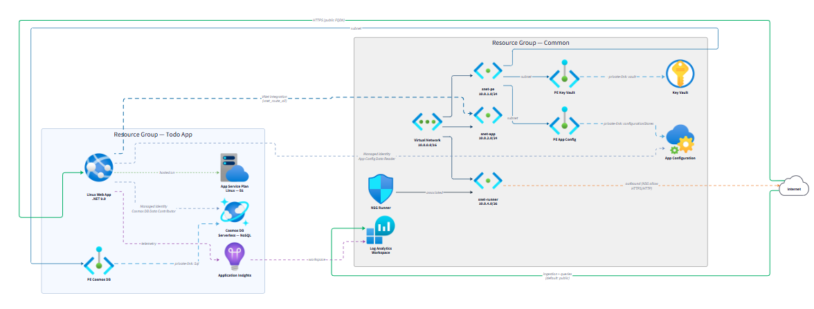

# skill-diagram-generators



This repository contains a **VS Code GitHub Copilot skill** for generating D2 architecture diagrams from Terraform/Terragrunt infrastructure, along with the Azure icon assets it depends on.

## Repository Contents

| Path | Description |
|------|-------------|
| `d2-diagram/SKILL.md` | Main skill definition — D2 language reference, workflow, mandatory questionnaire, icon resolution, sub-resource registry |
| `d2-diagram/internet-exposure-detection.md` | Companion reference for detecting internet-exposed Azure resources (linked from SKILL.md) |
| `icon-index-terraform-png.json` | Mapping of ~600+ Terraform resource types (`azurerm_*`, `azuread_*`) to PNG icon paths |
| `icon-index-terraform-svg.json` | Same mapping but for SVG icons |
| `icon-index-bicep-png.json` | Mapping of ARM/Bicep resource types (`Microsoft.*`) to PNG icon paths |
| `icon-index-bicep-svg.json` | Same mapping but for SVG icons |
| `png/Icons/` | Azure service icons in PNG format |
| `svg/Icons/` | Azure service icons in SVG format |
| `icon-mapping.json` | Full icon metadata (id, display name, category, resource type mappings, tags) |

## Installing the Skill in Your Own Repo

The skill is composed of **two files** that must stay together:

```
d2-diagram/
  SKILL.md
  internet-exposure-detection.md
```

### Option 1 — Per-repository (recommended)

Copy the `d2-diagram/` folder into your repo under `.github/copilot/skills/`:

```
<your-repo>/
  .github/
    copilot/
      skills/
        d2-diagram/
          SKILL.md
          internet-exposure-detection.md
```

The skill will be available to anyone working in that repository.

### Option 2 — Per-user (all workspaces)

Copy the `d2-diagram/` folder into your user-level skills directory:

| OS | Path |
|----|------|
| Windows | `%USERPROFILE%\.agents\skills\d2-diagram\` |
| macOS/Linux | `~/.agents/skills/d2-diagram/` |

The skill will be available across all your workspaces.

> **Note:** VS Code discovers skills via the YAML frontmatter (`name`, `description`) in `SKILL.md`. No additional registration is needed.

## Prerequisites

### 1. d2 CLI

The skill generates `.d2` source files and uses the `d2` CLI to render them to SVG or PNG. You must have `d2` installed and available in your PATH.

- Install: [https://d2lang.com/releases/install](https://d2lang.com/releases/install)
- Verify: `d2 --version`

### 2. Access to this GitHub repository (icon resources)

The skill fetches icon resources **at runtime** via `raw.githubusercontent.com` URLs pointing to this repository. Two types of resources are accessed:

| Resource | URL |
|----------|-----|
| **Icon mapping index** | `https://raw.githubusercontent.com/miiitch/skill-diagram-generators/refs/heads/main/icon-index-terraform-png.json` |
| **Icon PNG files** | `https://raw.githubusercontent.com/miiitch/skill-diagram-generators/refs/heads/main/png/Icons/...` |

**How it works:**

1. The skill looks up a Terraform resource type (e.g. `azurerm_linux_function_app`) in the mapping index JSON.
2. The mapping returns a relative path (e.g. `png/Icons/iot/10029-icon-service-Function-Apps.png`).
3. The skill builds the full URL by prepending the base path and embeds it in the generated `.d2` file via `icon:`.

**This means:**

- **This repository must be publicly accessible** on GitHub for the icons to load when diagrams are rendered.
- If the repository is private or unreachable, icons will not render. The skill falls back to `shape: rectangle` with a text label.
- No authentication token is needed as long as the repository is public.

## Forking / Self-Hosting Icons

If you want to host the icons yourself (e.g. for private/air-gapped environments):

1. **Fork** this repository to your own GitHub org (or mirror it to your own hosting).
2. **Edit `d2-diagram/SKILL.md`** — update the two URLs in the "Icon Source Requirement" section:

   ```
   - Mapping index: https://raw.githubusercontent.com/<YOUR-ORG>/<YOUR-REPO>/refs/heads/main/icon-index-terraform-png.json
   - Base path for icon files: https://raw.githubusercontent.com/<YOUR-ORG>/<YOUR-REPO>/refs/heads/main
   ```

3. The rest of the skill works without changes.

## Usage

1. Open a project containing Terraform (`.tf`) or Terragrunt (`.hcl`) files in VS Code.
2. Invoke the `d2-diagram` skill via GitHub Copilot (e.g. ask Copilot to generate an architecture diagram).
3. Answer the **12-question mandatory questionnaire** (network links, RBAC, monitoring, grouping mode, layout engine, theme, etc.).
4. The skill generates a `.d2` file with containers, nodes, connections, icons, and styles.
5. Render the diagram: `d2 --layout=elk diagram.d2 diagram.svg`

## License

MIT
